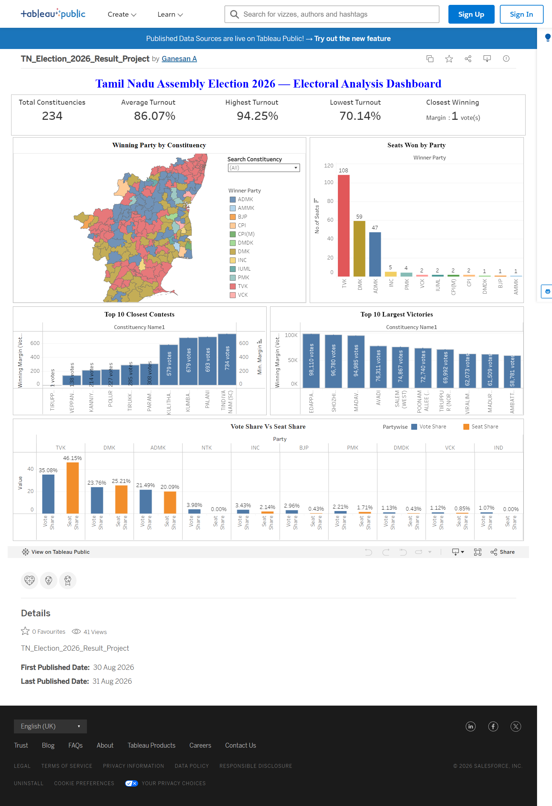

# Tamil Nadu Assembly Election 2026 — Electoral Data Analysis

## Project Overview

This project presents an end-to-end analysis of the Tamil Nadu Legislative Assembly Election 2026 results.

The objective was to transform official election data into a structured analytical dataset, perform constituency- and party-level analysis using SQL, and build an interactive Tableau dashboard to explore electoral outcomes across all 234 constituencies.

### Tools Used

- **Excel** — Data preparation, cleaning, and validation
- **MySQL / SQL** — Data analysis and transformation
- **Tableau Public** — Data visualization and interactive dashboard
- **GeoJSON** — Constituency-level spatial visualization
- **AI-assisted extraction** — Converting the official election-results PDF into structured tabular data

## Tableau Dashboard

The interactive Tableau dashboard provides a constituency-level view of the Tamil Nadu Assembly Election 2026 results, including winning parties, voter turnout, winning margins, seat distribution, and vote share versus seat share.

